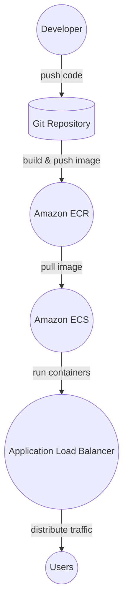

# API de Dados de Produção Vitivinícola

Esta API permite baixar e processar dados de produção vitivinícola diretamente do site da Embrapa. A API oferece endpoints para acessar dados de processamento, comercialização, importação e exportação de diversos tipos de uvas e produtos relacionados.

## Funcionalidades

- Download e processamento de arquivos CSV da Embrapa.
- Autenticação JWT para endpoints protegidos.
- Tratamento de erros e respostas padronizadas.

## Tecnologias Utilizadas

- Python
- Flask
- Flask-RESTX
- Flask-JWT-Extended
- Pandas

## Endpoints

### `GET /api/<action>/<type>`

Baixa e processa os dados CSV para a ação e o tipo especificados.

#### Parâmetros

- `action`: Tipo de ação (processamento, comercializacao, importacao, exportacao).
- `type`: Tipo de produto analisado (viniferas, americanasehibridas, etc.).

#### Exemplo de Requisição

```bash
curl -X GET "http://localhost:5000/api/processamento/viniferas"
```

### `POST /login`

Autentica o usuário e retorna um token JWT.

#### Parâmetros

- `username`: Nome de usuário.
- `password`: Senha do usuário.

#### Exemplo de Requisição

```bash
curl -X POST "http://localhost:5000/login" -H "Content-Type: application/json" -d '{"username":"zorzi","password":"biguxo"}'
```

### `GET /protegido`

Endpoint protegido que retorna a identidade do usuário autenticado.

#### Exemplo de Requisição

```bash
curl -X GET "http://localhost:5000/protegido" -H "Authorization: Bearer <seu-token-jwt>"
```

## Como Executar Localmente

### Pré-requisitos

- Python 3.7+
- Pipenv

### Passos

1. Clone o repositório:

    ```bash
    git clone https://github.com/seu-usuario/sua-api.git
    cd sua-api
    ```

2. Instale as dependências:

    ```bash
    pipenv install
    ```

3. Ative o ambiente virtual:

    ```bash
    pipenv shell
    ```

4. Execute a aplicação:

    ```bash
    python app.py
    ```

A API estará disponível em `http://localhost:5000`.

## Deploy no AWS

### Pré-requisitos

- Conta AWS
- AWS CLI configurado
- Docker instalado

### Visão Geral



### Passos

1. Crie um repositório no Amazon ECR:

    ```bash
    aws ecr create-repository --repository-name sua-api
    ```

2. Autentique o Docker no Amazon ECR:

    ```bash
    aws ecr get-login-password --region sua-regiao | docker login --username AWS --password-stdin <seu-id>.dkr.ecr.sua-regiao.amazonaws.com
    ```

3. Construa a imagem Docker:

    ```bash
    docker build -t sua-api .
    ```

4. Marque a imagem:

    ```bash
    docker tag sua-api:latest <seu-id>.dkr.ecr.sua-regiao.amazonaws.com/sua-api:latest
    ```

5. Faça o push da imagem para o Amazon ECR:

    ```bash
    docker push <seu-id>.dkr.ecr.sua-regiao.amazonaws.com/sua-api:latest
    ```

6. Crie um cluster ECS e uma tarefa ECS que utilize a imagem Docker.

7. Crie um serviço ECS que utilize a tarefa criada.

8. Configure um Load Balancer para expor a API na internet.

Agora sua API estará disponível publicamente através do serviço ECS no AWS.


