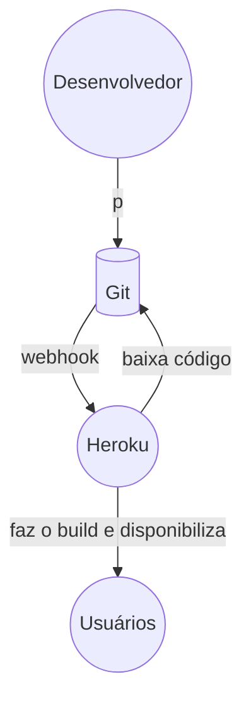

# API de Dados de Produção Vitivinícola

Esta API permite baixar e processar dados de produção vitivinícola diretamente do site da Embrapa. A API oferece endpoints para acessar dados de processamento, comercialização, importação e exportação de diversos tipos de uvas e produtos relacionados.

Você pode encontrar um preview do app rodando em: https://api-vitivinicola-e7feea405d27.herokuapp.com/

Esta localização deve mudar quando tivermos acesso ao console do AWS.

## Autores
- [Felipe de Paula Gomes](https://github.com/Felipe-DePaula)
- [Jorge Guilherme Dalcorso Wald](https://github.com/JorgeWald)
- [Leonardo Petersen Thomé Pires](https://github.com/leonardopires)

## Funcionalidades

- Download e processamento de arquivos CSV da Embrapa.
- Autenticação JWT para endpoints protegidos.
- Tratamento de erros e respostas padronizadas.

## Tecnologias Utilizadas

- Python
- Flask
- Flask-RESTX
- Flask-JWT-Extended
- Pandas

## Endpoints

### `GET /`
Abre a pagina com a documentação do Swagger.

Com Docker: http://localhost

Rodando diretamente: http://localhost:5000

(Veja o restante deste documento para ver como rodar de cada forma)

### `POST /auth`

Autentica o usuário e retorna um token JWT.

#### Parâmetros

- `username`: Nome de usuário.
- `password`: Senha do usuário.

#### Exemplo de Requisição

```bash
curl -X POST "http://<url>/auth" -H "Content-Type: application/json" -d '{"username":"zorzi","password":"biguxo"}'
```

### `GET /auth/profile`

Endpoint protegido que retorna a identidade do usuário autenticado.

#### Exemplo de Requisição

```bash
curl -X GET "http://<url>/auth/profile" -H "Authorization: Bearer <seu-token-jwt>"
```


### `GET /api/embrapa/<action>/<type>`

Baixa e processa os dados CSV para a ação e o tipo especificados.

#### Parâmetros

- `action`: Tipo de dado a ser retornado (processamento, comercializacao, importacao, exportacao).
- `type`: Tipo de produto analisado (viniferas, americanasehibridas, etc.).

#### Exemplo de Requisição

```bash
curl -X GET "http://<url>/api/embrapa/processamento/viniferas" -H "Authorization: Bearer <seu-token-jwt>
```

## Como Executar Localmente

### Pré-requisitos

- Python 3.7+
- Pipenv

### Passos

1. Clone o repositório:

    ```bash
    git clone https://github.com/leonardopires/tech-challenge-ia.git
    cd tech-challenge-ia
    ```

2. Instale as dependências:

    ```bash
    pipenv install
    ```

3. Ative o ambiente virtual:

    ```bash
    pipenv shell
    ```

4. Execute a aplicação:

    ```bash
    python -m flask run
    ```

A API estará disponível em `http://localhost:5000`.

## Executando a API com Docker Compose e Nginx

### Pré-requisitos

- Docker
- Docker Compose

### Construir e Iniciar os Contêineres

```bash
docker-compose up --build
```

A API estará disponível em `http://localhost`.

### Parar os Contêineres

Para parar os contêineres, pressione `Ctrl+C` no terminal onde o `docker-compose up` está sendo executado, ou execute o comando:

```bash
docker-compose down
```

## Deploy no Heroku

### Pré-requisitos

- Conta Heroku
- Acesso ao nosso repositório no GitHub

### Visão Geral



### Passos

1. Faça suas alterações em um branch
2. Crie um pull request
3. Faça o merge do seu pull request com a `main`
4. Aguarde alguns minutos
5. A API estará no ar em https://api-vitivinicola-e7feea405d27.herokuapp.com/ 
